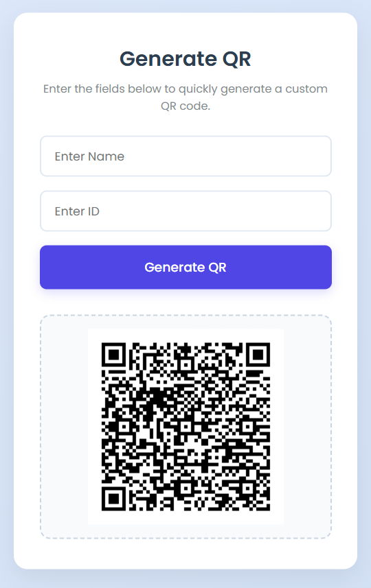
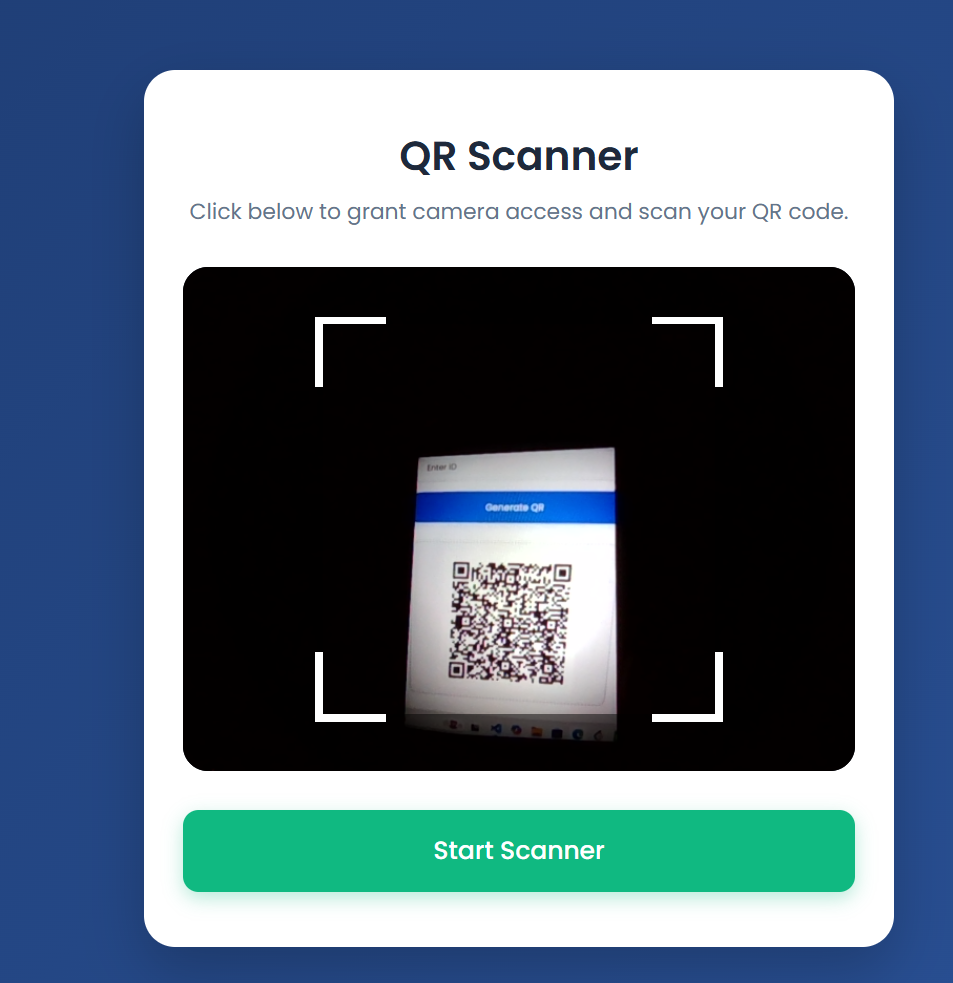
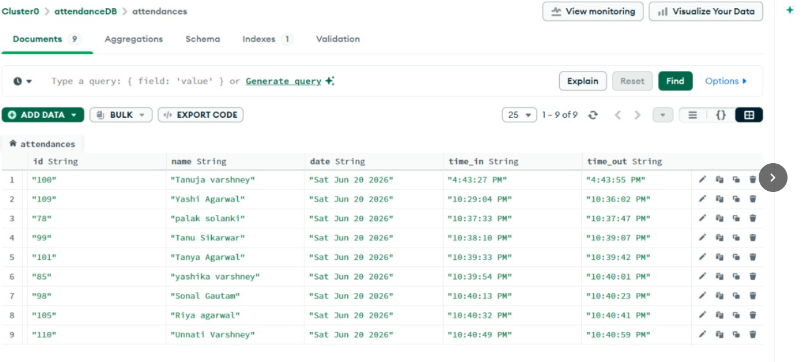
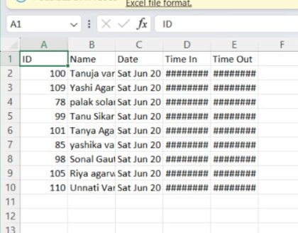

# 🔐 Secure Encrypted QR-Based Attendance Management System

A secure and efficient **QR Code-based Attendance Management System** developed during my internship at **ADRDE, DRDO, Agra**.

The system uses **AES-256 encryption** to generate secure QR codes and automatically records attendance with **Time In** and **Time Out** and **Date** in a MongoDB database.

---

## 🚀 Features

- 🔐 Secure QR Code Generation using AES-256 Encryption
- 📷 QR Code Scanning
- ⏰ Automatic Time In & Time Out
- ☁️ MongoDB Atlas Cloud Database
- 📊 Live Attendance Records
- 📁 Export Attendance as CSV
- 🌐 Responsive Web Interface
- 🔒 Secure Environment Variables (.env)

---

## 🛠️ Tech Stack

### Frontend
- HTML5
- CSS3
- JavaScript

### Backend
- Node.js
- Express.js

### Database
- MongoDB Atlas
- Mongoose

### Security
- AES-256-CBC Encryption
- Crypto Module
- Environment Variables (.env)

### Libraries Used

- Express.js
- Mongoose
- QRCode
- html5-qrcode
- Crypto
- CORS
- dotenv

---

## 📂 Project Structure

```
QR PROJECT
│
├── models
│   └── Attendance.js
│
├── public
│   ├── generate.html
│   ├── scanner.html
│   └── attendance.html
│
├── db.js
├── server.js
├── package.json
├── .gitignore
└── README.md
```

---

## ⚙️ Installation

### Clone Repository

```bash
git clone https://github.com/tanuja8923/Secure-Encrypted-QR-Attendance-System
```

### Install Dependencies

```bash
npm install
```

### Create .env File

```env
MONGODB_URI=your_mongodb_connection_string
SECRET_KEY=your_secret_key
```

### Start Server

```bash
node server.js
```

Open:

```
http://localhost:3000/generate.html
```

---

## 📸 Application Modules

- QR Code Generator
- QR Code Scanner
- Attendance Dashboard
- CSV Export

---

## 📸 Project Screenshots

### QR Generator



---

### QR Scanner



---

### Attendance Dashboard



---

### CSV Export


---

## 🔒 Security

- AES-256-CBC Encryption
- Environment Variables
- Secure MongoDB Atlas Connection
- Encrypted QR Authentication

---

## 🎯 Future Improvements

- Admin Login
- JWT Authentication
- Student Dashboard
- Email Notifications
- Analytics Dashboard
- Mobile Application
- Multi-user Support

---
## 🤝 Acknowledgement

This project was developed during my internship at **Advanced Data Research & Development Establishment (ADRDE), DRDO, Agra** under the guidance of **Mr. Afzal Qureshi (Scientist, ADRDE)**.

---

## ⭐ If you like this project

Give this repository a ⭐ on GitHub.